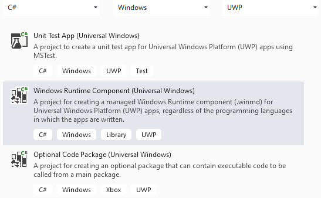
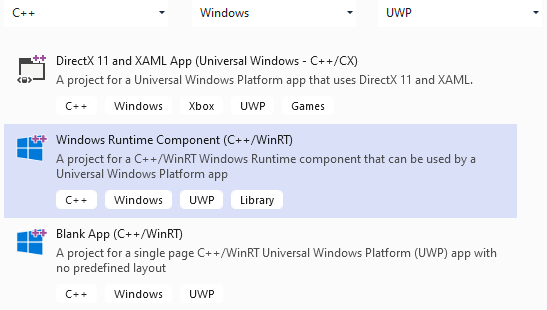
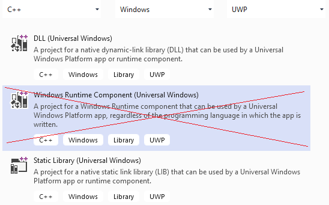

> **This documentation and the underlying platform code is a work in progress.** >**Examples (C# and C++/WinRT):**
>
> - [Native Module Sample in microsoft/react-native-windows-samples](https://github.com/microsoft/react-native-windows-samples/tree/master/samples/NativeModuleSample)
> - [Sample App in microsoft/react-native-windows/packages/microsoft-reactnative-sampleapps](https://github.com/microsoft/react-native-windows/tree/master/packages/microsoft-reactnative-sampleapps)

This guide will help set you up with the Visual Studio infrastructure to author your own stand-alone native module for React Native Windows. In this document we'll be creating the scaffolding for a `MyLibrary` native module.

## Development Environment

Make sure you have installed all of the [development dependencies](rnw-dependencies.md).

If you're planning on writing in C++, you *must* install the [C++/WinRT Visual Studio Extension](https://marketplace.visualstudio.com/items?itemName=CppWinRTTeam.cppwinrt101804264).

## New Project (optional)

If you already have an existing native module project for iOS/Android, you can skip straight to [Manually Adding Windows Support](#manually-adding-windows-support).

Otherwise, if you're creating a new project from scratch, the quickest way is to follow the official React Native instructions at https://facebook.github.io/react-native/docs/native-modules-setup.

```cmd
yarn global add create-react-native-module
create-react-native-module MyLibrary
```

Now you'll have a new native module project under `react-native-my-library`. Be sure to look at the command output for further steps you'll want to do before publishing the project.

## Manually Adding Windows Support

> **The plan is to automate this process as part of a CLI new library project template, see issues [3201](https://github.com/microsoft/react-native-windows/issues/3201) and [3203](https://github.com/microsoft/react-native-windows/issues/3203). However we are also documenting the manual process here for developers who are unable to use the CLI.**

### Updating your package.json

You'll need to ensure you have version 0.61 of both `react-native` and `react-native-windows`. In the directory for your native module project, you can update the dependencies with the following:

```cmd
yarn add react-native@0.61 --dev
yarn add react-native-windows@0.61 --peer
```

Now it's time to switch into Visual Studio and create a new project.

### Creating the Visual Studio Project / Solution

Open Visual Studio and select `Create a new project`. You're going to create a new `Windows Runtime Component` project, which produces a library that is compatible with Windows UWP apps.

If you're planning on writing your native module in C#, you'll want to choose the C# `Windows Runtime Component (Universal Windows)`:



If you're planning on writing your native module in C++, you'll want to choose `Windows Runtime Component (C++/WinRT)`:



> **Important:** You want *C++/WinRT*, not *C++/CX*. Do **not** choose the C++/CX `Windows Runtime Component (Universal)` project-type:
> 
> 
> 
> If you don't see the `Windows Runtime Component (C++/WinRT)` project type, go back and install the _C++/WinRT Visual Studio Extension_ under [Development Environment](#development-environment).

1. Set the `Project Name` to `MyLibrary`.
1. Set the `Location` to the native module directory (typically the same directory with the `ios` and `android` sub-directories).
1. Set the `Solution Name` to `MyLibrary`.
1. Click `Create`.

Next you'll be prompted to select the versions of Windows you'll support. This should match the values for React Native Windows, which as of version 0.61, are:

1. Set the `Target version` to `Windows 10, version 1903 (10.0; Build 18362)`.
1. Set the `Minimum version` to `Windows 10 Creators Update (10.0; Build 15063)`.

You should now have a new `MyLibrary` solution file at `.\MyLibrary\MyLibrary.sln` and a `MyLibrary` project at `.\MyLibrary\MyLibrary\MyLibrary.csproj` for C# or `.\MyLibrary\MyLibrary\MyLibrary.vcxproj` for C++.

Additionally, for C++/WinRT projects, you'll need to change the following:

1. Right click on the project and choose `Manage Nuget Packages...`
    1. Select version 2.0.190730.2 for Microsoft.Windows.CppWinRT package.
1. Right-click on the project and choose `Properties`
    1. Under `Linker > Windows Metadata` set `Generate Windows Metadata` to `Yes`.

Now, before we go any further we'll want to rename the root directory of the Windows native code to `windows` to match the peer `android` and `ios` directories:

1. Close the solution with `File` > `Close Solution`.
1. Rename that top `MyLibrary` directory `windows`.
1. Re-open the solution file at `windows\MyLibrary.sln`.

> *Optional*: Whether you're creating a new native module from scratch, or adding windows support to an existing ios/android module, if you're using git, you'll want to add Visual Studio-specific entries in your project's `.gitignore`.
> The simplest way to do this is to get [VisualStudio.gitignore](https://raw.githubusercontent.com/github/gitignore/master/VisualStudio.gitignore) and save it as `windows\.gitignore`.

Now it's time to add React Native Windows into the solution.

### Adding React Native Windows to the Visual Studio Solution

We're going to add several React Native Windows projects to your solution. So to avoid confusing them with your own code, we're first going to create a solution folder called `ReactNative`:

1. Open the Solution Explorer sidebar.
1. Right-click on `Solution 'MyLibrary'` at the top.
1. Select `Add` > `New Solution Folder`.
1. Name the folder `ReactNative`.

Now we're going to add all of the following React Native Windows projects to that `ReactNative` folder. All of these projects are located under the `node_modules\react-native-windows` directory in the root of your `react-native-my-library` project directory.

> _For more details about what these projects do, see [Project Structure](project-structure.md)._

| VS Project                          | Project File                                                                     |
| :---------------------------------- | :------------------------------------------------------------------------------- |
| Chakra                              | `Chakra\Chakra.vcxitems`                                                         |
| Common                              | `Common\Common.vcxproj`                                                          |
| Folly                               | `Folly\Folly.vcxproj`                                                            |
| JSI.Shared                          | `JSI\Shared\JSI.Shared.vcxitems`                                                 |
| JSI.Universal                       | `JSI\Universal\JSI.Universal.vcxproj`                                            |
| Microsoft.ReactNative               | `Microsoft.ReactNative\Microsoft.ReactNative.vcxproj`                            |
| Microsoft.ReactNative.Cxx           | `Microsoft.ReactNative.Cxx\Microsoft.ReactNative.Cxx.vcxitems`                   |
| Microsoft.ReactNative.SharedManaged | `Microsoft.ReactNative.SharedManaged\Microsoft.ReactNative.SharedManaged.shproj` |
| Mso                                 | `Mso\Mso.vcxitems`                                                               |
| ReactCommon                         | `ReactCommon\ReactCommon.vcxproj`                                                |
| ReactWindowsCore                    | `ReactWindowsCore\ReactWindowsCore.vcxproj`                                      |
| Shared                              | `Shared\Shared.vcxitems`                                                         |

For each project, you'll do the following:

1. Open the Solution Explorer sidebar.
1. Right-click on the `ReactNative` folder.
1. Select `Add` > `Existing Project...`.
1. Select the project file and click `Open`.

You now have all of the React Native Windows projects to your solution. Next we're going to reference them in our `MyLibrary` project.

### Referencing React Native Windows in your Project

The only project reference you **must** add is `Microsoft.ReactNative`. To add the reference:

1. Open the Solution Explorer sidebar.
1. Right-click on your `MyLibrary` project.
1. Select `Add` > `Reference`.
1. Select `Projects` on the left-hand side.
1. Check the box next to `Microsoft.ReactNative`.
1. Click `OK`.

After you've added the reference, you need to make sure it doesn't copy itself into your build (otherwise it'll cause build conflicts down the line when you're trying on consume your library):

1. Open the Solution Explorer sidebar.
1. Under your `MyLibrary` project, expand the `References`.
1. Right-click on `Microsoft.ReactNative`.
1. Select `Properties`.
1. Under `Build`, Change `Copy Local` to `False`.

Now, you're technically ready to go, but in order to improve the developer experience, it's also **highly recommended** to also add a reference to the appropriate helper shared project. These projects contain the attributes (C#) and macros (C++) as described in the [Native Modules](native-modules.md) and [View Managers](view-managers.md) documents.

If you're writing in C#, you'll want to add `Microsoft.ReactNative.SharedManaged`:

1. Open the Solution Explorer sidebar.
1. Right-click on your `MyLibrary` project.
1. Select `Add` > `Reference`.
1. Select `Shared Projects` on the left-hand side.
1. Check the box next to `Microsoft.ReactNative.SharedManaged`.
1. Click `OK`.

If you're writing in C++, you'll want to add `Microsoft.ReactNative.Cxx`:

1. Open the Solution Explorer sidebar.
1. Right-click on your `MyLibrary` project.
1. Select `Add` > `Reference`.
1. Select `Shared Projects` on the left-hand side.
1. Check the box next to `Microsoft.ReactNative.Cxx`.
1. Click `OK`.

### Testing your Build

To make sure that everything is working, you'll want to try building `MyLibrary`. First you'll want to make sure you've chosen a supported platform:

1. At the top, change the `Solution Platform` to `x86` or `x64`.
1. In the `Build` menu, select `Build Solution`.

### Next Steps

You have now created the scaffolding to build a native module or view manager. Now it's time to add the business logic to the module - follow the steps described in the [Native Modules](native-modules.md) and [View Managers](view-managers.md) documents.