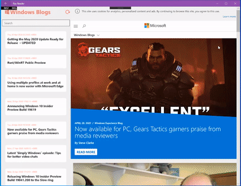

We're on React Native core version 0.62 with new community modules, native module support across multiple platforms, and of course our official public release of React Native for macOS.

<!--truncate-->

## Version 0.62-preview Released

As promised in our previous milestone post, we're chugging along and keeping as up-to-date with the latest React Native core version as we can. That means for this latest milestone release we are officially announcing our [0.62-preview of React Native for Windows](https://www.npmjs.com/package/react-native-windows/v/0.62.0-preview.6)!

As usual this means that our getting started guides and general docs will also be updated to reflect these changes.

## React Native for macOS

One of our biggest announcements recently is our addition and full support of the React Native for macOS extension! We are super excited to be developing React Native support for macOS along side our Windows effort.

Although still a fork, we have an official [npm package out for React Native for macOS](https://www.npmjs.com/package/react-native-macos) and a [repo available](https://github.com/microsoft/react-native-macos) to the public to follow and contribute to - we hope to see some really cool React Native apps out there in the future that can now truly run everywhere.

## New Module Support!

We've begun addressing the Windows community module support gap - starting with two contributions from us! The [**WebView**](https://github.com/react-native-community/react-native-webview) and [**Camera**](https://github.com/react-native-community/react-native-camera) modules.

On top of those initial two, we're looking at a whole bunch of other ones we know are awesome and essential to have when building a React Native app in general. Check out the full list of what we're tracking and planning to tackle next on our [GitHub Project Board](https://github.com/microsoft/react-native-windows/projects/23) for modules.

We're also introducing release stages!

### WebView

The WebView module sets you up with the barebones web hosting tech that's available nativly on the device you're targetting - as a bonus it works with macOS as well!

### Camera

The Camera module is another big step towards making it easier to give you unfettered access to native APIs.

Just like on mobile, when you define a CameraFeed module, and the device you're running the app on has a camera attached, the component will hookup to the correct native APIs to give you access to the hardware needed to snap sweet pics.

## React Native on the Surface Duo

React Native runs on the Surface Duo!

This is a little bit to be expected, as React Native works great today with Android, but just running on the new Surface Duo device isn't enough. We've also added support for awareness of the dual-screen device and it's status through shipping two important APIs: **TwoPaneView** and **DeviceInfoModule**.

To learn more about developing on the Surface Duo with React Native, [go check out our latest blog post](https://devblogs.microsoft.com/surface-duo/build-react-native-apps-for-microsoft-surface-duo/) detailing the experience.

## New Release Processes

We are also rolling out a new release process and cadence in order to better ensure release quality as well as give consumers of **React Native for Windows** earlier access to the new features if needed.

| 
Title
 | 
Expectations
 |
|:--|:-----|
| **Master** | builds are built directly from our master branch. These builds provide no guarantees around upstream React version, breaking changes, or overall stability. These builds should be used for development or to test bleeding edge functionality, but should not be relied upon for production use. Master builds are versioned as 0.0.0-master.x.|
| **Preview** | builds are the first released by stable branches. These builds aim to become increasingly polished over time, and have less breaking changes than in master. react-native-windows-init will consider preview builds but warn users before installing them. Preview builds are versioned as 0.x.0-preview.y where x matches the minor release of React Native. |
| **Latest** | builds are kept free of breaking or high-risk changes. These are considered to be stable but will still receive bug fixes for customer-blocking issues. Latest builds are versioned as 0.x.y where x matches the minor release of React Native.|
